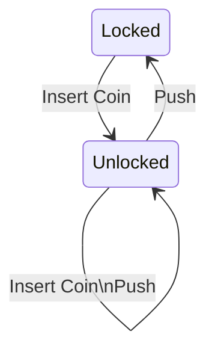

# ST8 - A Simple Finite State Machine

ST8 is a [finite state machine](https://en.wikipedia.org/wiki/Finite-state_machine) library, designed to help you keep track of the current state and manage state transitions. It is thread-safe, allows re-entrancy (with some guardrails), and helps ensure that no invalid state transitions can occur.

## Usage

The core of ST8 is the `StateMachine` class. This keeps track of the current state, which state transitions are valid, and dispatches callbacks for state transitions.

`StateMachine` uses types (classes and interfaces) to determine what transitions are valid. To create an instance you will need to use a `StateMachine.Builder`; this is where the valid transitions are defined. Once a `StateMachine` is created the valid transitions are locked in and can't be changed.

The last step in building a `StateMachine` instance is providing the initial state. This is just the first state that the machine has. Later you can use the `transition` methods to change the state.

Interested parties can register callbacks for specific state transitions. These callbacks are register for specific type-to-type transitions. During registration a `CallbackToken` is returned. This can be used to remove the callback later.

### Idempotency

Every transition call is considered a state change, even if the new state is the exact same instance as the current state. But this functionality isn't available by default; you must specifically add the transition from that class to itself as a valid one.

### Callback Order

Callbacks may be called in any order. You should not rely on the order of the callbacks, as this may change in a future release. 

### Re-entrancy

It is not uncommon to want to add or remove callbacks or transition again within a callback. This is perfectly allowed, with a couple caveats.

#### Adding or Removing Callbacks

Adding or removing callbacks can be done at any time, but will not take effect until the next state transition.

##### Example

```java
StateMachine<String> stateMachine = ...;
CallbackToken a = stateMachine.addCallbackForAnything((from, to) -> System.out.println("A"));
stateMachine.addCallbackForAnything((from, to) -> {
    System.out.println("B");
    stateMachine.removeCallback(a);
    stateMachine.addCallbackForAnything((from, to) -> System.out.println("A"));
});
stateMachine.transition("Hello");
stateMachine.transition("Goodbye");
```

This example has three callbacks that are registered. In the first transition (to "Hello") both "A" and "B" will be printed. In the second transition (to "Goodbye") "A" and "C" will be printed.

#### State Transitions

You may transition state within a callback, but with limitations. The second transition will be queued until all callbacks for the current transition have been called. This means that callbacks will never miss a transition that went by too fast. You can not queue up more than one transition. This will result in a `TransitionContentionException` being thrown.

##### Example

```java
StateMachine<String> stateMachine = ...;
stateMachine.addCallbackForAnything((from, to) -> stateMachine.transition("Farewell"));
stateMachine.addCallbackForAnything((from, to) -> stateMachine.transition("Goodbye"));
stateMachine.transition("Hello");
```

This example would result in an error. Two callbacks have been registered and each tries to change the state. During the transition to "Hello" the first callback asks to change the state to "Farewell". This transition will be queued. Then the second callback tries to change the state to "Goodbye". This would add a second transition to the queue, even if it was trying to make the exact same state change. This is not allowed and a `TransitionContentionException` would be thrown by the second callback.

## Full Demo

This demo will incrementally build a turnstile model. It walks through a variety of scenarios, and some code will be rewritten by the end. The full code for this demo is available in the `demos/turnstile/` folder.

A turnstile starts off locked. You can insert a coin, at which point it becomes unlocked. If you push a locked turnstile, it won't open. If you push an unlocked turnstile it will consume the coin and then open. Coins can be stacked (if you insert three coins the turnstile can be opened three times). Here's a diagram for all of the valid transitions:



### Creating a builder

To create a `StateMachine` we need to start off with a `StateMachine.Builder`. 

```java
StateMachine.Builder turnstileBuilder = StateMachine.newBuilder();
```

`StateMachine` uses types to determine what transitions are valid. We can add a bit of type safety by providing a base type for all of the different state types. This is usually an interface, but classes are allowed. You can technically use `Object`, but this is discouraged, as it prevents some type safety checks.

```java
interface TurnstileState {}

StateMachine.Builder<TurnstileState> turnstileBuilder = StateMachine.<TurnstileState>.newBuilder();
```

### Defining States

At this point let's round out the states that our turnstile can be. According to the above description the turnstile can be locked or unlocked. Also, when unlocked we need to know how many credits the user has.

```java
public interface TurnstileState {}
public interface LockedState extends TurnstileState {}
public class UnlockedState implements TurnstileState {
    public final int credits;
    public UnlockedState(int credits) {
        this.credits = credits;
    }
}
```

If you're using a version of Java that supports [Records](https://openjdk.org/jeps/395) you may find that those are a very handy way of building your states. [Sealed classes](https://openjdk.org/jeps/409) are also very handy for ensuring that your finite state machine is actually finite:

```java
public sealed interface TurnstileState {}
public record LockedState() implements TurnstileState {}
public record UnlockedState(int credits) implements TurnstileState {}
```

However, for the rest of this example we'll assume that we are using JDK 11 and these features are not available.

### Defining Valid Transitions

Now that we've got our state types we need to tell the builder what transitions are allowed. We do this with `StateMachine.Builder#addValidTransition`.

```java
public interface TurnstileState {}
public interface LockedState extends TurnstileState {}
public class UnlockedState implements TurnstileState {
    public final int credits;
    public UnlockedState(int credits) {
        this.credits = credits;
    }
}

StateMachine.Builder<TurnstileState> turnstileBuilder = StateMachine.<TurnstileState>.newBuilder()
        .addValidTransition(LockedState.class, UnlockedState.class)
        .addValidTransition(UnlockedState.class, LockedState.class)
        .addValidTransition(UnlockedState.class, UnlockedState.class);
```

Note that we added a transition from Unlocked to Unlocked. This is required because we will actually make this transition (when adding a coin to an unlocked turnstile, or when pushing a turnstile with more than one credit). By default this kind of transition is not allowed.

All we have left in creating our `StateMachine` is to provide an initial state. The turnstile should start off locked. Since the locked state doesn't have any methods or fields it can be more efficient to create a single instance of it and re-use that each time we need it. So we'll create an anonymous instance and stash it in a static field.

```java
public interface TurnstileState {}
public interface LockedState extends TurnstileState {}
public class UnlockedState implements TurnstileState {
    public final int credits;
    public UnlockedState(int credits) {
        this.credits = credits;
    }
}

private static final LockedState LOCKED = new LockedState() {};

StateMachine<TurnstileState> turnstile = StateMachine.<TurnstileState>.newBuilder()
        .addValidTransition(LockedState.class, UnlockedState.class)
        .addValidTransition(UnlockedState.class, LockedState.class)
        .addValidTransition(UnlockedState.class, UnlockedState.class)
        .buildWithInitialState(LOCKED);
```

Note that there's no point in keeping the `StateMachine.Builder` instance around now. It supports a continuation style so that you can build the `StateMachine` this way.

### Using the Turnstile

At this point the turnstile is completely usable. We can add methods that allow us to insert a coin or push, and callbacks so we can see the state transitions:

```java
turnstile.addCallbackFromAnythingTo(LockedState.class, () -> System.out.println("Locked"));
turnstile.addCallbackFromAnythingTo(
    UnlockedState.class,
    (unlocked) -> System.out.println("Unlocked, Credits: " + Integer.toString(unlocked.getCredits())));

public boolean push(StateMachine<TurnstileState> turnstile) {
    if (turnstile.isState(UnlockedState.class)) {
        int credits = ((UnlockedState) turnstile.getCurrentState()).getCredits();
        if (credits <= 1) {
            turnstile.transition(LOCKED);
        } else {
            turnstile.transition(new UnlockedState(credits - 1));
        }
        return true;

    } else {
        return false;
    }
}

public void insertCoin(StateMachine<TurnstileState> turnstile) {
    int credits = isState(UnlockedState.class) ? ((UnlockedState) getCurrentState()).credits : 0;
    turnstile.transition(new UnlockedState(credits + 1));
}
```

One little detail that's important here. We capture the number of credits in `push` and `insertCoin` before providing the `UnlockedState` implementation and use that variable in the anonymous implementation. We can't lazily query the current state of the `StateMachine` inside the `UnlockedState` implementation, because we'd be getting it from the ***current*** state instead of the ***previous*** state. We'd probably get a stack overflow since this would be an endless recursive call.

We also don't want to capture the prior state and call its methods. This would work for a little while, but if we added enough coins we would end up with a huge number of recursive calls, and would also get a stack overflow.

If you're referring to data that was available in prior states it's safest to hold on to the data you need, and not hold onto a reference of the prior state at all.

### Deriving From StateMachine

While the above example is functional, it's a little ungainly. The action methods aren't tied to the StateMachine instance at all. It would make things a bit cleaner if we could tie `push` and `insertCoin` to the StateMachine class. We can do that by creating a Turnstile class derived from StateMachine. 

```java
public class Turnstile extends StateMachine<TurnstileState> {
    private static final LockedState LOCKED = new LockedState() {};
    
    public Turnstile() {
        super(
            StateMachine.<TurnstileState>newBuilder()
                .addValidTransition(LockedState.class, UnlockedState.class)
                .addValidTransition(UnlockedState.class, LockedState.class)
                .addValidTransition(UnlockedState.class, UnlockedState.class),
            LOCKED);
    }
    
    public boolean push() {
        // see push() implementation above.
    }
    
    public void insertCoin() {
        // see insertCoin() implementation above.
    }
}
```

This gives us a cleaner model. `push` and `insertCoin` are now members of Turnstile, which is itself a `StateMachine`. And that pesky little `LOCKED` implementation detail is hidden as a member of this class.

### Deriving from ProtectedStateMachine

The above example still isn't perfect. The `transition` methods are still available on `Turnstile`. You could accidentally transition from an Unlocked state with 10 credits to a Locked state. This is technically allowed by the StateMachine, but it breaks our business rules. We could clean this up a bit more by only exposing a read-only facade of the `StateMachine` where the transition method is protected. A `ProtectedStateMachine`...

```java
public final class Turnstile extends ProtectedStateMachine<TurnstileState> {
    private static final LockedState LOCKED = new LockedState();

    public Turnstile() {
        super(
            StateMachine.<TurnstileState>newBuilder()
                .addValidTransition(LockedState.class, UnlockedState.class)
                .addValidTransition(UnlockedState.class, LockedState.class)
                .addValidTransition(UnlockedState.class, UnlockedState.class)
                .buildWithInitialState(LOCKED));
    }

    public boolean push() {
        if (isState(UnlockedState.class)) {
            int credits = ((UnlockedState) getCurrentState()).credits;
            if (credits <= 1) {
                transition(LOCKED);
            } else {
                transition(new UnlockedState(credits - 1));
            }

            return true;
        } else {
            return false;
        }
    }

    public void insertCoin() {
        int credits =
                isState(UnlockedState.class) ? ((UnlockedState) getCurrentState()).credits : 0;

        transition(new UnlockedState(credits + 1));
    }
}
```

`ProtectedStateMachine` takes an underlying `StateMachine` and forwards all calls to it The transition methods are marked as protected so the derived class has access to them, but no other classes do. Now we've got a nicely encapsulated Turnstile class. Callers can still subscribe to state transitions and call the action methods that are exposed, but the underlying transition methods are hidden.

Both `StateMachine` and `ProtectedStateMachine` implement `ReadableStateMachine`. This interface is useful if you only need the current state or callbacks.
